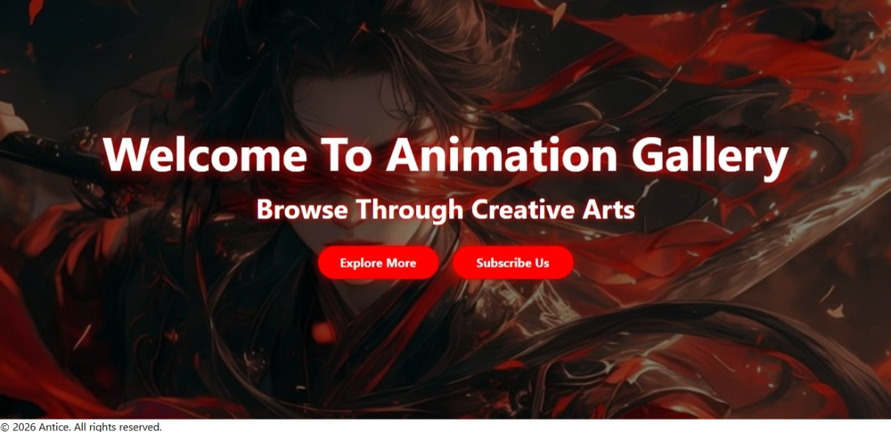
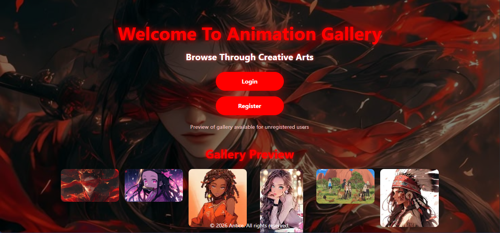
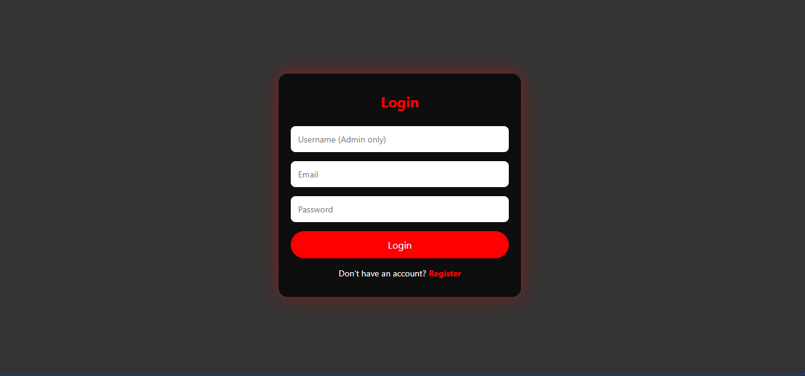
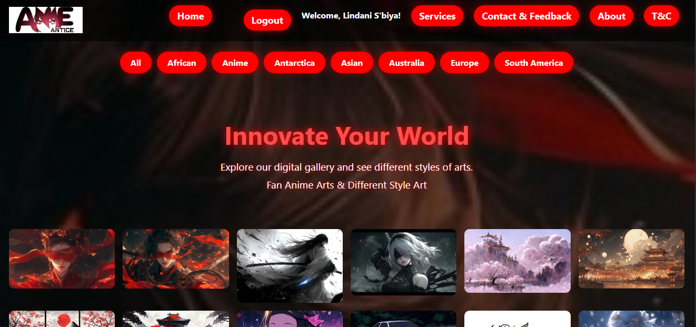
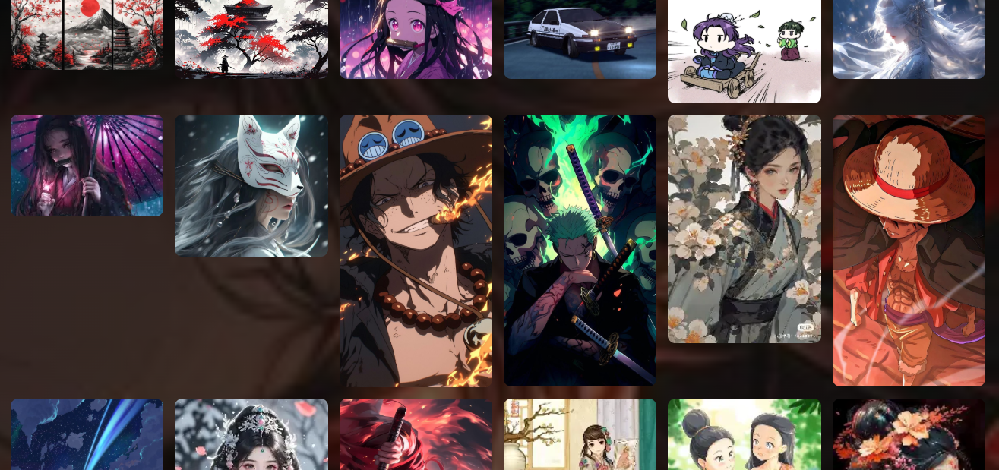
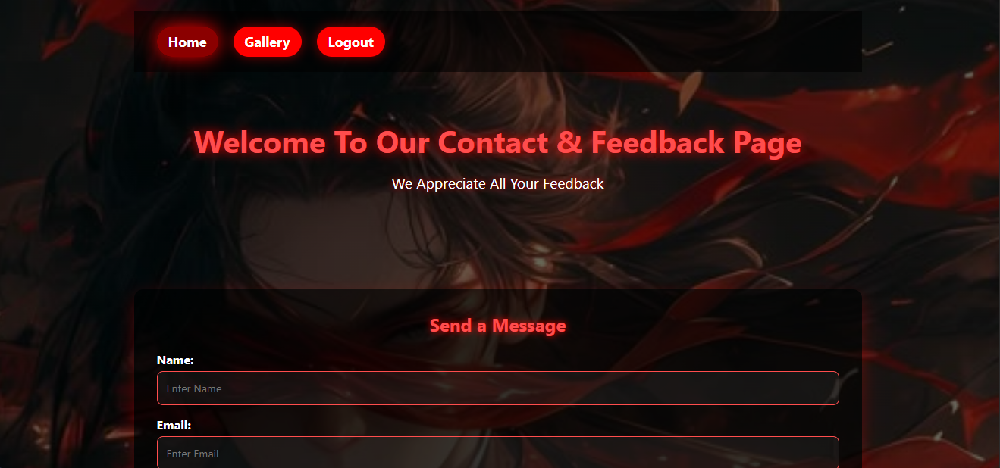
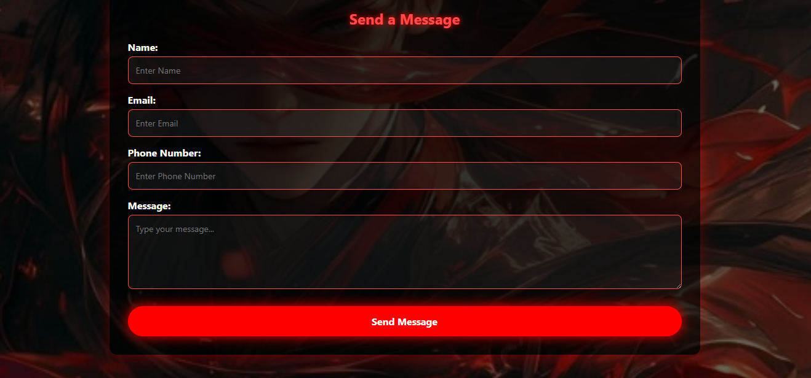
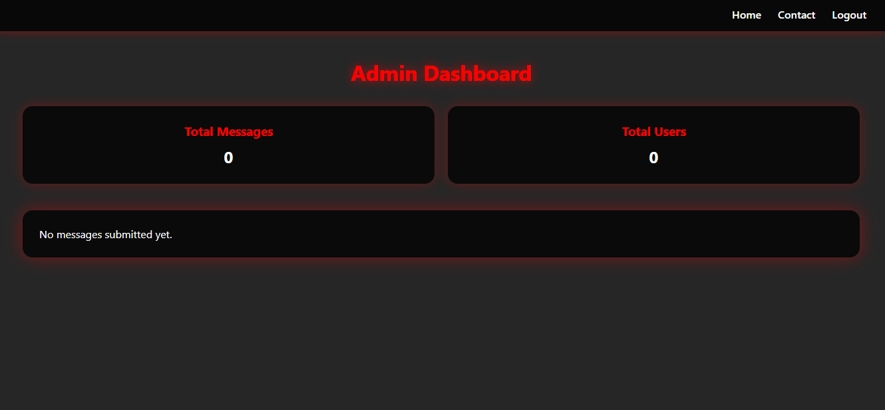

# Animation Gallery Website 🎨


A visually appealing, interactive **Animation Gallery** website built with **HTML, CSS, and JavaScript**.  

This project showcases animations, galleries, and UI design, demonstrating **front-end development skills**.


---


## 🔗 Live Demo

Check it out here: [Live Demo](https://neliswa14-afk.github.io/animation-gallery/)  


---


## 🖼️ Screenshots

### Home Page




### Welcome Page




### Login Page




### Register Page

[Register Page](screenshots/register-page.png)


### Gallery Page 1




### Gallery Page 2




### Contact Page 1




### Contact Page 2




### Admin Dashboard Page



---


## ✨ Features

- Responsive layout for desktop and mobile

- Interactive gallery with hover effects

- Smooth animations and transitions

- Clean, organized code structure

- Supports multiple animation types (GIFs, SVGs, etc.)


---


## 🛠️ Technologies Used

- **HTML5** – Semantic markup

- **CSS3** – Styling and animations

- **JavaScript (ES6)** – Interactivity


---


## 📁 Project Structure

animation-gallery/

│

├── index.html

├── welcome.html

├── login.html

├── register.html

├── gallery.html

├── contact.html

├── admin-dashboard.html

├── README.md

├── LICENSE

│

├── css/

│   └── style.css

│

├── js/

│   └── script.js

│

├── assets/

│   └── images/          # all images for website (logo, icons, banners)

│

├── screenshots/          # screenshots for README

│   ├── home-page.png

│   ├── welcome-page.png

│   ├── login-page.png

│   ├── register-page.png

│   ├── gallery-page1.png

│   ├── gallery-page2.png

│   ├── contact-page1.png

│   ├── contact-page2.png

│   └── admin-dashboard-page.png


## 🚀 Installation

To run this project locally:

1\. Clone the repository:

&nbsp;  ```bash

&nbsp;  git clone https://github.com/neliswa14-afk/animation-gallery.git


## 🎮 How to Use

Navigate the website using the main menu.

Explore animations in the gallery pages.

Register or login to access the Admin Dashboard (demo content only).

Fill out forms on the Contact page for interactive UI testing.


\## Author

Neliswa Biyela

Junior Software Developer


